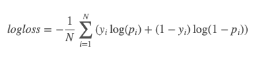

<b> CHURN MODEL - KKBOX ENTERPRISE</b>

* <b>KKBOX</b> es el servicio de transmisión de música líder en Asia, y cuenta con la biblioteca de música Asia-Pop más completa del mundo con más de 30 millones de canciones.

* El desafío consiste en desarrollar un algoritmo que prediga si un usuario de suscripción dejará de usar el servicio, esto, con un conjunto de testeo (Marzo 2017) de la empresa <b>KKBOX</b> .
 
* Para un negocio de suscripción, predecir con precisión el abandono es fundamental para el éxito a largo plazo. Incluso pequeñas variaciones en la rotación pueden afectar drásticamente las ganancias.

* La métrica de evaluación es <b>Log Loss</b>, donde <b>N</b> es el número de observaciones, Log es el logaritmo natural, <b>yi</b> es el objetivo binario y  <b>pi</b> es la probabilidad de predecir que <b>yi es igual a 1</b>

1. <b>Sprint 1: Datos transformados I</b>

Crear funciones que permitan construir los siguientes features para cada msno:
Recencia: cantidad de días desde el último evento de la tabla user_logs.csv
Frecuencia: cantidad de eventos entre los últimos N y N+M días de la tabla user_logs.csv
Money: cantidad de dinero pagado entre los últimos N y N+M días de la tabla transactions.csv
Utilizar valores de N y M que capturen comportamiento en última semana, últimas 2 semanas, último mes y últimos 2 meses (queda abierto si se quiere utilizar más valores).

<a href="./Sprint 1/DBAnalytics_EDA_01.ipynb">DBAnalytics_EDA_01</a>: El objetivo de este notebook es realizar una primera aproximación a los dataset de KKBOX, para ello se utilizo el <a href="https://arxiv.org/pdf/1408.2041.pdf">framework de turi Graphlab</a> el que permite manejo de archivos de gran volumen, despues de revisar sus principales caracteristicas, se procedio a guardar los archivos en el formato nativo de Graphlab para en analisis EDA mas en detalle y con mejor velocidad de lectura.

<a href="./Sprint 1/DBAnalytics_EDA_02.ipynb">DBAnalytics_EDA_02</a>: El objetivo de este notebook es entender en detalle las caracteristas de los usuarios que suscribieron el servicio de KKBOX, para ello se exploraran todos los dataset disponibles por la empresa.

2. <b>Sprint 2: Datos transformados II</b>

En base a las funciones RFM del Sprint 1, crear nuevos features para cada variable en el dataset user_logs.csv y transactions.csv (sólo si aplica).
Crear nuevas funciones para construir features tales como:
Tendencias de actividad del msno entre diferentes rangos de tiempo usando diferentes variables, usando variables del dataset user_logs.csv
Métricas de la actividad del msno usando diferentes variables del dataset transactions.csv 
En base a las funciones implementadas (y otras definidas por cada grupo), se deben implementar al menos 300 features. 

3. <b>Sprint 3: Datos mapeados x algoritmo I</b>

Implementar función que genere la variable dependiente a predecir (revisar código WSDMChurnLabeller.scala y descripción en bases de concurso Kaggle)
Construir el “tablón” final que ingresará al algoritmo (particionando por train/test/validación)
Entrenar el modelo usando el algoritmo Gradient Boosting Trees (en particular usando las implementaciones XGBoost o LightGBM), para un set de parámetros fijo (exploratorio).

4. <b>Sprint 4: Datos mapeados x algoritmo II</b>

Realizar una búsqueda de hiper-parámetros para entrenar el modelo usando el algoritmo Gradient Boosting Trees.
Explorar el impacto de cada feature en el modelo, de dos maneras: 
Tests KS univariados comparando las poblaciones Churn vs No-Churn
Performance del modelo entrenado con y sin el feature (sensibilidad)
Calcular el uplift del resultado final para el segmento de los top 10K msno’s. (%churn rate top 10K vs %churn rate total)

